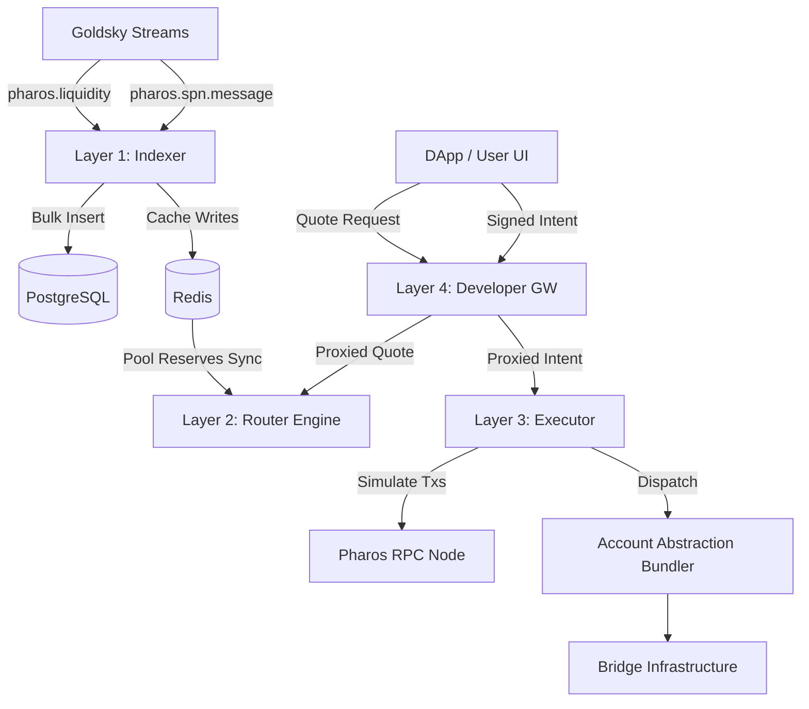

# FaroLink Architecture Deep-Dive

FaroLink adopts a strict 4-tier microservice architecture to decouple Data Availability, Route Formulation, Transaction Assembly, and Public Ingress. This repository manages four independent node projects.

## Component Interactions

## Layer 1: Indexer (`farolink-indexer`)
The Indexer is a pure data-pipeline module. 
- **Resiliency:** Connects to Goldsky WS streaming endpoints using a rigorous Exponential Backoff reconnection strategy. Employs 30s ping-pong keepalives.
- **Buffer Flush Ingestion:** Prevents PostgreSQL pooling crashes by storing incoming events in memory arrays and flushing them via single transaction `COMMIT` loops inside Postgres.

## Layer 2: Routing Engine (`farolink-router`)
The brains of the protocol. Employs a custom multi-dimensional weighted Graph.
- Calculates edges as: `Base Weight = 1.0 + (Fee Bps / 10000) + (Latency / 100000)`.
- Reconstructs its edge cache from Redis every 10 seconds.
- Uses Dijkstra’s pathfinding algorithm to weave across `dex_pool` edges and `bridge` edges across multiple domains.

## Layer 3: Executor (`farolink-executor`)
Replaces archaic "sendTransaction" patterns.
- **The Abstractor:** Wraps diverse bridge payload designs (e.g. CCTP payload vs Wormhole Message) under a unified `BridgeTx` intent object.
- **Pre-Flight Sandbox:** Intercepts proposed hops using `provider.call()`, throwing alerts internally if the transaction would revert on network to proactively prevent gas waste.
- **Fallback Circuit Breaker:** Natively shifts payloads internally if the simulated bridge fails (e.g. pivoting instantly to LayerZero if Native Pharos latency spikes).

## Layer 4: Developer API (`farolink-api`)
The facade ingress module. 
- Prevents DDoS with `express-rate-limit`.
- Implements rigorous Zod verification so malformed calls to `/execute` are slashed prior to reaching the heavily-loaded internal executor cluster.
